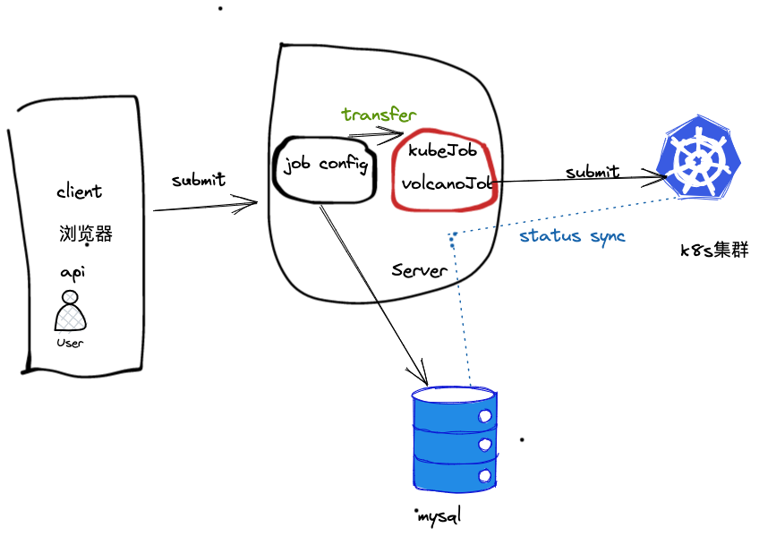
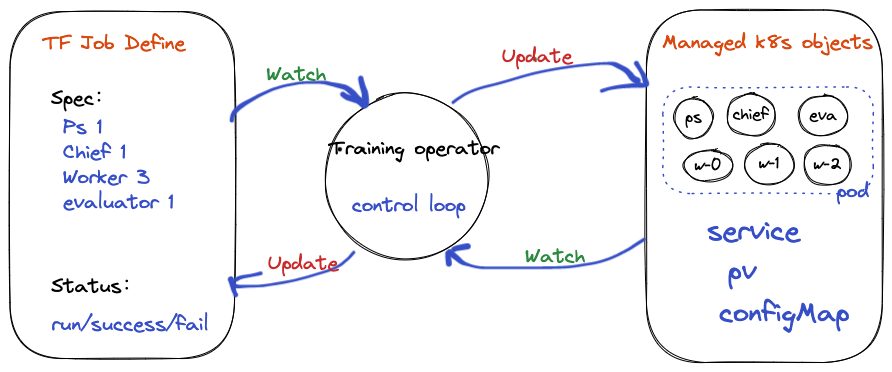
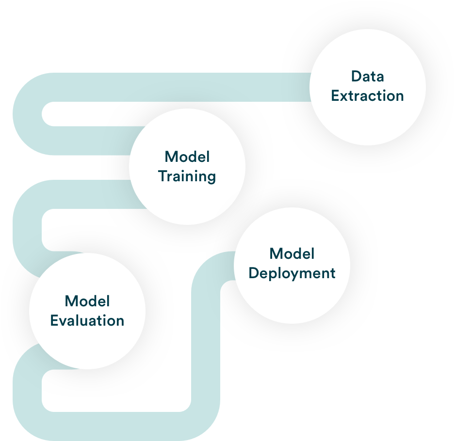

# EasyAI 机器学习平台核心设计文档

> Author: @shuaiyy
>
> 部分模块的设计文档会单独拆分出来，本文档只做简单的概述，不会包含所有细节。
>
> Status: Active

## 背景／Background

EasyAI，使用golang通用后端技术栈 + k8s云原生生态开发的机器学习平台，致力于提供一站式的平台解决方案。

作为机器学习平台的开发者和维护者，该项目考虑的问题是：

+ 低开发/改造成本：只需1个高级devops工程师即可开发整个平台项目，并同时维护k8s底层基础设施
+ 低运维成本: 基于k8s云原生生态，不绑定云厂商，同时支持多集群的管理
+ 实现业务价值的同时，保证个人成长: easyai使用了很多云原生生态下的项目，社区还有更多优秀的开源项目值得学习、借鉴和使用。
+ devops和PaaS：保障平台和业务的稳定性、可观测，优化计算成本等

从产品OWNER的视角，该项目需要做到：

+ 低使用成本和学习成本: 平台面向的用户是算法工程师、数据分析师、产品经理，而不是devops工程师、后端开发
+ 支持机器学习的各类业务场景: 如模型开发、模型训练等
+ 持续优化使用体验，提高用户的工作效率

### 开源产品对比

|                 | 状态   | 后端技术栈   | 前端技术栈   | 多集群支持 | 其他     |
|-----------------|------|---------|---------|-------|--------|
| open pai(微软)    | 停止维护 | python? | ts?     | No    | ---    |
| kubeflow(谷歌)    | 活跃   | ?       | ?       | No    | ---    |
| cube(腾讯音乐)      | 活跃   | python  | 自研低代码框架 | Yes   | ---    |
| kubeDL(阿里)      | 活跃   | go?     | react?  | No    | ---    |
| arena(kubeflow) | 较活跃  | go?     | 无前端     | No    | 只是一个工具 |
| polyaxon(社区版)   | ？    | python? | ts?     | No    | ---    |
| aios开源版(第四范式)   | 停止维护 | java?   | ?       | No    | ---    |

p.s. 本小节信息不保证准确性，仅供参考。如有批评指正，我们会立即修改。

1. cube支持多集群，且产品化程度高，如果需要开箱即用的机器学习平台产品，建议使用cube
2. kubeflow，用户的学习成本较高，需要了解k8s的基本概念，且需要编辑k8s crd yaml文件来提交job、创建model server等。
   kubeflow以微服务的方式整合了大量优秀的开源ml相关项目，非常值得学习，但是二次开发和改造有些挑战。
3. arena，命令行工具，简化了向k8s提交job/service的流程，但是没有前端，其用户交互可以作为开发CLI工具的参考。
4. kubeDL，CNCF孵化项目，目前还在开发中，有一个简单的前端，其核心是使用k8s自定义CRD+Controller实现的，值得关注。

#### 用户权限和团队协作

kubeflow和arena的把用户信息映射为k8s用户，通过istio7层路由的rbac做权限控制；不利于用户权限的收敛和回收，不方便多集群的扩展

kubeflow只有2种用户，普通和集群管理员； 缺乏项目组或者Team的概念。需要协作时，需要用户主动授权给协作方。

#### 数据存储和使用

kubeflow使用k8s原生的pvc，创建和使用很不方便。 对算法同学有很高的学习成本

#### 资产管理

如镜像版本、用户代码、数据集、模型文件等

#### 作业管理

job需要有唯一id， job配置需要持久化, 不能只放到k8s里 ；job要支持重跑，支持问题定位和性能分析，支持账单成本统计等

#### 可观测性

+ 基础监控
+ 作业告警

## 相关文档／Reference

## 设计目标／Design Goals

+ 多k8s集群支持，兼容k8s 1.18~1.25,不绑定云厂商和云产品
+ job管理和调度，支持多种算法框架的分布式训练（可扩展），支持高级调度特性
+ 追求MLOps最佳实践，优先使用云原生里已有的开源组件
+ 提供友好的使用UI，降低使用成本
+ 算力管理和平台运维，降低运维成本

本设计不解决以下问题：

1. 不考虑支持任何和k8s生态不兼容的组件、系统
2. 暂不考虑数据特征处理、在线流式训练等涉及到大数据生态的基建

## 概览／Overview

这一节可能是整个设计文档中最重要的一节。从宏观的角度讲清楚设计的思路。

### 用户权限和角色

登录和认证：

1. 提供用户注册和登录接口；
2. 使用cookies保存用户token，作为登录状态。token可以同时用于CLI、api和web。
3. sso支持，不考虑支持ldap等sso认证方式。但是可以通过修改`login`接口实现任意的登录方案。

团队协作：

1. 将业务/项目组空间映射成k8s的namespace；同一空间的用户有权查看他人的资源
2. 空间管理员有权停止、删除他人资源

更多细节，请查看 [《用户权限》](./user_permission.md)设计文档

### job管理

**Experiment**：实验组，可以包含一组job，方便查看、管理 与协作。

**Job**：一个特定算法框架的训练作业，包含1~N个Task实例

**Task**：Pod计算实例，执行训练相关的任务逻辑，Task可能有多种类型，如：master、worker、ps、evaluator等

#### **定义**

涉及的参数：

1. 资源和调度
    + 集群、空间、调度约束
    + 资源配额
2. Job状态
    + status message reason
    + 启动时间、运行时长
    + state状态转换
3. 通用配置： 用于生成一组相同角色的worker
4. 框架相关配置
    + 生成不同角色的pod实例
    + 框架相关的参数：实例的服务发现、启动顺序等， 不同的框架配置不同

#### **实现**

基于 [kubeflow training-operator](https://github.com/kubeflow/training-operator) + [volcano job](https://github.com/volcano-sh/volcano)
实现各种算法框架在k8s的分布式训练

1. 作业编排
2. 生命周期管理

JobConfig -生成->  kfJob/vcJob CRD -提交-> k8s集群 <-watch&sync-> mysql

1. 将jobconfig转换成kubeJob或者volcano job
2. 状态同步，需要维护一个状态机，将k8s job的状态同步到mysql job config
3. 查看job详细和容器日志

kubeflow training-operator做的事情，**reconcile(调和)**

+ 创建不同角色的实例Pod
+ 为实例提供服务发现
+ 控制不同角色实例的启动顺序
+ 状态同步，根据全部or部分实例的成功或失败，更新Job的状态

#### 任务数据和产出

+ 使用nfs作为开箱即用的默认存储，按约定使用，基于job id隔离.
+ k8s pod 的volume mount支持sub-path + 环境变量，因此可以做到task级别的目录隔离

平台使用约定：

| 环境变量          | 容器内路径               | nfs后端存储路径                                   | 备注                                  |
|---------------|---------------------|---------------------------------------------|-------------------------------------|
| summary_dir   | /summary_dir        | `nfs_prefix/{job_id}/{task_id}/summary_dir` | 存储训练的summary log，tensorboard会用到这个约定 |
| model_dir     | /model_dir          | `nfs_prefix/{job_id}/model_dir`             | 存储任务产出的模型，模型仓库/模型服务发布会用到这个          |
| log_dir       | /log_dir            | `nfs_prefix/{job_id}/log_dir`               | 平台依赖，持久化标准输入输出日志                    |
| data_dir      | /data_dir           | `nfs_prefix/data/{owner}`                   | 训练数据，只读                             |
| pre_model_dir | /pre_model_dir      | `nfs_prefix/{pre_job_id}/pre_model_dir`     |                                     |
| share_dir     | /share_dir          | `nfs_prefix/{job_id}/share_dir`             | 分布式训练共享目录                           |
|               | /workspace/personal | `nfs_prefix/notebook/{owner}`               | notebook 个人文件                       |
|               | /workspace/public   | `nfs_prefix/notebook/public`                | notebook 文件，对所有人公开                  |

对于其他类型的存储：

支持使用k8s Volume机制来使用自定义存储，如pvc、hostPath等；需要管理员提前创建并告知用户使用方式。

数据权限管理的模块，后期需要考虑。

#### 调度

**调度策略**

+ **gang scheduler**：all or zero。 避免资源死锁，一个job的所有task 仅在可以同时满足创建条件时调度；
+ **binpack**：集中式调度，避免资源碎片
+ **优先级调度**：高优作业优先调度
+ **抢占调度**：高优作业在资源不足时，可以杀死正在运行的低优作业，抢占其资源。如果优先级设置的不合理，可能会出现无辜的受害者。

**调度约束**

+ node selector：选择特定的节点调度
+ toleration taints：支持容忍污点；建议给gpu节点打上污点。
+ 资源超卖：对于cpu/memory，允许设置 request = limit / N; 优点是可以调度更多容器，缺点是超卖太多可能会cpu过载或者内存oom。
    + 对于notebook、tensorboard、serving等特殊实例，设置超卖有显著收益；训练任务要结合监控看具体的资源使用情况；
+ 资源隔离和资源限制：不同的业务方可以基于k8s namespace，限制其使用机器的范围，使用cpu/memory/gpu的数量;
  尤其是业务方携带自己的服务器加入平台时。

#### 作业状态机

**状态机作用**

1. 将k8s集群的job状态数据同步回数据库
    + job的启动时间、运行时长、调度时间
    + job的容器状态信息、运行的节点ip、显卡id等
    + job和容器失败时的message和reason
2. 根据相关指令触发创建、停止、删除k8s job
3. 在状态转换时，发送通知给用户

+ 初始状态：queued/unknown
+ 中间状态： pending/running
+ 终止状态：success、failed stopped

**转化条件**：

+ 基于action： init start stop finish
+ action可以由用户设置(stop)，或者状态机转换逻辑

**状态转换列表**

| 当前状态                           | 下一个状态        | 转换条件                              | 备注           |
|--------------------------------|--------------|-----------------------------------|--------------|
| queued/unknown                 | pending      | action=start 或者 k8sJob is created | 正在调度或创建容器    |
| queued/unknown/pending         | running      | k8sJob is running                 | job运行中       |
| pending/running                | success/fail | k8sJob finished                   | job已经结束      |
| queued/unknown/pending/running | stopped      | action=stop                       | 用户主动停止或者运行超时 |

**控制循环**

状态机的实现，类似k8s operator中的controller，区别是job定义存储在mysql表中，没法利用k8s的异步编程模型来list-watch，只有主动Add的方式；

**同步周期**

unknown： 10s

running： 10m

其他状态：立即加入执行队列
重入队：指数回退时间间隔

#### job日志

1. 通过 k8s pod/log api查询运行中的容器标准输出；job终止后就无法查询日志了。
2. 持久化日志到nfs
3. 使用elk之类的日志系统收集，或者通过sdk上报给日志平台

#### job debug

在任务容器中，启动后台进程，用于debug

1. 远程登录
    + cli侧，通过k8s remote exec api实现
    + web侧，通过web-shell + k8s svc + k8s ingress实现
    + 标准sshd服务，基于openssh server实现
2. web ide
    + jupyter lab； 依赖python环境
    + vscode web；依赖nodejs环境
3. 提供static-cli-tools
    + 用户的镜像可能不会安装很多linux工具，比如ping、curl等
    + 如果有静态编译的二进制工具，可以考虑注入到容器里。
4. 进程管理和反向代理
    + 基于supervisord管理后台服务进程
    + 使用http反向代理，提供统一的http访问入口
        + 避免为每个服务进程创建service和ingress
        + 1个job包含N个task，每个task可能会运行M个后台服务， 如果不使用反向代理，需要维护N*M个ingress规则，不方便维护和扩展

## 开发环境（jupyter服务）

### 功能

+ 提供jupyter notebook/lab服务
+ 提供vscode web ide
+ 提供ssh登陆和remote开发
+ 提供web terminal

### 实现

基于Job + job-debug所的功能实现。

1. 用户创建1个notebook server对象
2. 点击启动后，根据notebook server的配置，创建一个特殊的Job，同时为Job创建svc和ingress用于http访问。
3. 观察job的状态，同步到数据库，并在前端展示
4. 到期或用户主动停止，停止并删除关联的job

**与Job不同的地方**：

1. 只有1个pod实例，特殊的Job，运行时环境和任意Job都一样
2. 默认挂载开发所需的存储
3. 默认开启资源超配，提高调度成功率。
4. 提供超时销毁机制，避免长时间占用资源。
5. 有独立的UI和管理界面

### 数据访问

1. 训练数据和产出数据，存储在nfs中
2. 在训练任务中访问数据，可以参考章节： [job管理-任务数据和产出](#任务数据和产出)
3. hive、hadoop等，可以考虑在容器启动时，注入client和配置文件并配置环境变量
4. 数据上传：web ui、s3接口、平台client工具
5. 数据下载：web ui、平台client工具

### API/SDK/CLI

#### 认证

认证基于jwt token，无论是web、http api还是CLI，统一使用token进行身份认证

token仅会用到其中的user-id，token里携带的其他信息不会用于鉴权

#### 功能规划

**第一期**

+ job管理：crud、 stop、 delete
+ job编排和调度：优先支持tf分布式
+ 远程登录容器，查看job容器日志，下载job产出
+ 告警通知

**第二期**

+ 支持更多的分布式训练框架
+ 支持Job debug高级功能

### Pipeline

> A machine learning pipeline is a way to codify and automate the workflow it takes to produce a machine learning model.
> Machine learning pipelines consist of multiple sequential steps that do everything from data extraction and
> preprocessing to model training and deployment.

通过yaml定义出一个有向无环图，用于描述工作流中的每一个步骤，然后由pipeline引擎负责执行。

1. 如何尽可能的简化定义
2. 如何将输出(std、exit-code、files)传给下一个执行节点
3. 如何执行判断分支
4. 如何实现通用的executor。每一个步骤都是通过容器执行的，有些逻辑需要通过封装sdk/client执行或者调用其他平台的接口。

使用场景：

1. 模型串行训练，将上一个训练job产出的模型，作为下一个job的预训练模型
2. 生产工作流：对于较为固定、且高频使用的工作流场景，收益明显。 数据处理--> 模型训练 --> 模型评估 --> 模型部署

本质上是对已有工作流程的串行化和自动化，但是pipeline的定义和executor开发对算法开发的同学来讲是有成本的。

可以参考 kubeflow pipeline 或这 argo workflow。

### 模型仓库

> 只是一个想法

概念上类似gitlab、镜像仓库、gfrog artifacts仓库；

1. 管理的是binary file，不关心文件格式和内容，提供版本管理和必要的meta信息。
2. 提供独立的鉴权和访问token，基于s3的标准接口访问数据
3. 能够打通模型训练、模型发版、模型服务发布的流程
4. 支持不同模型格式的版本转换

## 模型发布服务

### 简单AI应用

赋能算法同学，快速开发&发布web应用；用于模型快速验证、向业务方提供演示demo等

+ 支持streamlit、gradio等python全栈web开发框架，不需要了解前端技术栈
+ 支持gpu算力
+ 一键发布，自动提供HTTP路由

### 模型推理服务

基于k8s云原生的开源方案seldon-core或kServe，提供支持主流算法框架模型的模型发布服务：

1. 支持滚动发布、灰度发布
2. 提供路由和访问入口
3. 如何和其他微服务打通？同网关、中间件的适配？
4. 模型调用的前置、后置处理？
5. 模型加载、卸载的性能问题？
6. 如何保障生产的可用性、稳定性？如何支持全链路的压测？

使用场景：允许算法同学在平台直接发布一个推理服务，然后可以通过http、grpc测试。

## 附加说明／Caveat （optional）

这一节可以对设计中所做的一些折中和妥协做一些说明。往往是解释为什么没有选择另一个方案。

### 容器网络

1. k8s集群外的dns解析问题，比如访问大数据集的服务。
2. 高速网络的管理和使用，比如rdma、infiniband等

### job状态同步

为什么要把job状态同步回mysql？直接存在k8s里不行吗

1. 我们使用唯一的ID来追踪job，而不是每次都去k8s里根据(cluster, namespace, name)检索
2. k8sJob是一组k8s资源对象的合集，我们收集的不仅仅是某一CR的信息、还会涉及关联的容器运行信息、容器日志、event事件等
3. k8s里的大部分状态数据都是临时的，大部分资源有GC回收策略；
4. 对于已经终止的k8s job，我们会将其从k8s中删除，定位问题则依靠mysql中信息。

### job容器监控

pod/node cpu memory gpu监控数据, 需要Prometheus技术栈的支持

## 其他考虑 （optional）

### 开发与测试

+ 平台后端依赖的是mysql、redis、k8s集群（和其上的组件）、nfs存储；
+ 前端资源：可以由后端动态加载，也可以使用nginx做前后端分离部署。
+ 如果不涉及job的执行、k8s集群的管理，则可以不依赖k8s集群

本地可以使用kind部署标准的k8s集群，目前测试的版本是1.19~1.25.

### 运维

+ mysql、redis、k8s集群（和其上的组件）、nfs存储等增加监控
+ 依赖的服务做高可用部署

### 代码位置 （optional）

这个项目代码所在的位置。 API／IDL等外部接口描述文件的位置。

[github](https://github.com/easyai-io/easyai-platform)

## 版本信息

本文档的历史版本。

| 版本号 | 修改者      | 日期         | 描述  |
|-----|----------|------------|-----|
| 0.1 | @shuaiyy | 2023-08-01 | 第一版 |
| 0.2 |          |            |     |